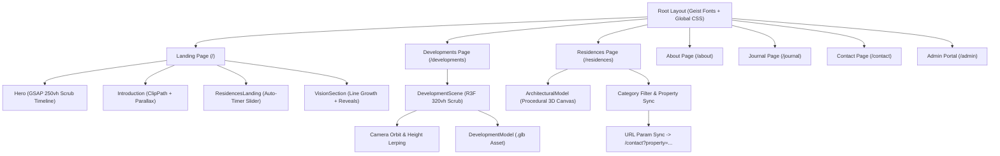

# Technical Architecture & Engineering Manual

This manual documents the engineering principles, animation systems, 3D WebGL pipeline, design tokens, and coding conventions across the **VALOIS Estates & Mansions** web platform.

---

## 1. System Architecture

The application is structured as a client-first, high-performance static/dynamic application built on **Next.js 16 (App Router)** and **React 19**.

---

## 2. Animation & Motion Architecture (GSAP)

All high-fidelity animations rely on **GSAP 3** and its **`ScrollTrigger`** plugin.

### Key Rules for GSAP in React 19 / Next.js
1. **Always use `gsap.context()`**: Wrap every timeline or scroll trigger setup inside `gsap.context(() => { ... }, containerRef)` in a `useEffect`. Always return `() => ctx.revert()` to ensure pristine cleanup during unmount and Next.js hot reloads.
2. **Use `autoAlpha` instead of bare `opacity`**: `autoAlpha` smoothly interpolates `opacity` while automatically setting `visibility: hidden` when 0, preventing phantom pointer-event blocks or layout interference.
3. **Scrubbing Standards**:
   * Scrub speeds typically use `scrub: 1` to `scrub: 1.5` for cinematic inertia.
   * Pinned sections (e.g., `Hero.jsx` at `250vh`, `developments/page.jsx` at `320vh`) pin the viewport element via `sticky top-0 h-screen overflow-hidden`.
4. **Hardware Acceleration**: Elements undergoing scale, rotation, or y-axis movement are marked with `will-change-transform` or `transformOrigin` explicitly defined.

---

## 3. 3D WebGL & Three.js Pipeline

3D experiences are powered by `@react-three/fiber` and `@react-three/drei`.

### 1. Scroll-Driven Camera Controller (`DevelopmentScene.jsx`)
Instead of OrbitControls on the developments showcase, camera motion is strictly bound to page scroll:
* A scroll progress reference (`progressRef.current`, float `0.0 -> 1.0`) is updated synchronously by GSAP `ScrollTrigger` on the outer `320vh` container.
* In R3F `useFrame(state, delta)`:
  * The progress is partitioned into phases using `THREE.MathUtils.smoothstep`:
    * **Intro** (`0.00 -> 0.22`): Model scales from `0.72` to `1.0`, rises up from `y = -2.2` to `0.0`.
    * **Orbit** (`0.18 -> 0.68`): Angle sweeps from `-0.55` to `Math.PI * 1.35`.
    * **Detail Zoom** (`0.55 -> 0.80`): Camera radius tightens from `12.0` down to `7.2`, height drops from `5.8` down to `3.4`.
    * **Outro** (`0.78 -> 1.00`): Camera recedes back to radius `13.0`, height to `7.0`.
  * Camera position is interpolated with frame-rate independent dampening: `camera.position.lerp(cameraTarget, 1 - Math.pow(0.001, delta))`.

### 2. Model Normalization (`DevelopmentModel.jsx`)
To allow any `.glb` or `.gltf` asset to be swapped in seamlessly:
* An axis-aligned bounding box (`THREE.Box3`) measures the model's dimensions dynamically.
* The model scale is normalized: `scale = 5.5 / maxDimension`.
* The model position is auto-centered on `(x: 0, z: 0)` and placed with its base flush on the ground plane (`y = -box.min.y * scale`).
* Meshes are automatically traversed to enable `castShadow = true`, `receiveShadow = true`, and apply enhanced environment map intensity (`envMapIntensity = 0.75`).

### 3. Procedural Architectural Generator (`ArchitecturalModel` in `residences/page.jsx`)
For property listings without heavy pre-baked 3D assets, a procedural generator renders custom architectural geometries on the fly:
* **Penthouses:** Multi-tiered vertical tower, glass balconies (`meshPhysicalMaterial` with transmission & transparency), and bronze crowns.
* **Private Estates:** Horizontal cantilevered minimalist pavilion, textured limestone blocks, slim pillars, and shimmering water pool.
* **Waterfront:** Curvilinear cylindrical residence, cantilevered blocks, wooden deck base, and surrounding blue reflective water plane.

---

## 4. Design Language & Tokens

### Color Matrix
* **`#0B0D12` & `#090A0D`**: "Obsidian Base" — Primary luxury dark background.
* **`#C5A880`**: "Champagne Gold" — Primary accent, active indicators, CTA buttons, border highlights.
* **`#9A8060`**: "Muted Bronze" — Sub-headings, numbering, category indicators.
* **`#E8E4DB`**: "Linen / French Alabaster" — High-contrast editorial cream background.
* **`#F4F1EA`**: "Parchment White" — Primary readable text on dark canvases.
* **`#11120F`**: "Charcoal Ink" — Primary text on cream/linen canvases.

### Typographic Contrast
* **Headings:** Serif, ultra-light (`font-light`), tight leading (`leading-[0.78]` to `leading-[0.88]`), negative tracking (`tracking-[-0.06em]` to `tracking-[-0.08em]`).
* **Subheaders & Labels:** Monospace or Sans-serif, uppercase, ultra-wide tracking (`tracking-[0.25em]` to `tracking-[0.35em]`), tiny sizes (`text-[8px]` to `text-[10px]`).

---

## 5. URL Query Synchronization & Lead Funnel

* When browsing **Residences** (`/residences`), users can filter properties or click "Inquire About Property".
* The CTA routes dynamically to `/contact?property={property.id}`.
* In [**`src/app/contact/page.jsx`**](file:///E:/projects/adestra-real-estate/src/app/contact/page.jsx), `useSearchParams()` detects the `property` parameter and automatically binds it to the consultation form's dropdown.
* Both `/residences` and `/contact` wrap their client search parameter consumers in `<Suspense>` boundaries to maintain full compatibility with Next.js static generation.

---

## 6. Guidelines for Extending the Codebase

1. **Adding a New Property:**
   * Update the `PROPERTIES_DATA` array in [**`src/app/residences/page.jsx`**](file:///E:/projects/adestra-real-estate/src/app/residences/page.jsx).
   * Update `PROPERTIES_LIST` in [**`src/app/contact/page.jsx`**](file:///E:/projects/adestra-real-estate/src/app/contact/page.jsx) so it appears in the inquiry dropdown.
2. **Adding a New 3D Development:**
   * Provide a `.glb` or `.gltf` model URL in the `DEVELOPMENTS` array in [**`src/app/developments/page.jsx`**](file:///E:/projects/adestra-real-estate/src/app/developments/page.jsx).
   * The normalization logic in `DevelopmentModel.jsx` will handle scale, centering, and shadows automatically.
3. **Modifying GSAP Timelines:**
   * Never bind scroll animations directly to global `window.onscroll`. Always use `ScrollTrigger.create()` or `timeline({ scrollTrigger: ... })` within a `gsap.context()`.
