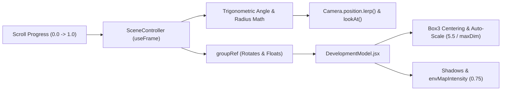

# 3D WebGL & Three.js Developments Guide (`src/components/developments`)

This directory contains the Three.js and React Three Fiber (R3F) implementation for the 3D development showcases.

---

## Architecture Overview



---

## 1. `DevelopmentScene.jsx`

### Canvas Settings
* **Pixel Ratio:** `dpr={[1, 1.5]}` (balances Retina sharpness with GPU performance).
* **Initial Camera:** `position: [12, 5.8, 12]`, `fov: 32`, `near: 0.1`, `far: 200`.
* **Renderer Config:** `gl={{ antialias: true, alpha: true, powerPreference: 'high-performance' }}`.

### Lighting Setup
* **Ambient Light:** `intensity: 0.55` for base ambient illumination.
* **Key Directional Light:** Warm white (`#fff7e8`), `intensity: 3`, `position: [8, 12, 8]`, `castShadow` with `1024x1024` shadow map.
* **Rim/Accent Directional Light:** Champagne gold (`#c5a880`), `intensity: 1.2`, `position: [-8, 5, -6]` to highlight architectural silhouette edges.
* **Environment:** `@react-three/drei` `<Environment preset="city" />` for realistic reflections on glass and polished stone.
* **Contact Shadows:** `<ContactShadows position={[0, -2.15, 0]} opacity={0.38} scale={18} blur={2.8} far={8} resolution={512} />`.

### Camera Choreography Math (`SceneController`)
The scroll progress (`progressRef.current`, float `0.0 -> 1.0`) is passed from GSAP `ScrollTrigger` into the R3F `useFrame` loop.

Camera trajectory is computed using 4 smoothed phase curves:
1. **Intro (`0.00 -> 0.22`):**
   * Model scales from `0.72 -> 1.0` and rises from `y = -2.2 -> 0.0`.
   * Camera look target smoothly transitions from ground `y = 0` to mid-height `y = 0.5`.
2. **Orbit (`0.18 -> 0.68`):**
   * Angle sweeps from `-0.55 rad` to `1.35π rad` (~243 degrees).
   * Group rotates along y-axis in harmony with the camera.
3. **Detail Inspection (`0.55 -> 0.80`):**
   * Camera radius tightens from `12.0 -> 7.2`.
   * Camera height lowers from `5.8 -> 3.4` for an intimate architectural glance.
4. **Outro (`0.78 -> 1.00`):**
   * Radius expands to `13.0`, height elevates to `7.0` for a grand exit perspective.

#### Mathematical Lerping:
Camera movement is dampened frame-rate independently using:
```javascript
camera.position.lerp(cameraTarget.current, 1 - Math.pow(0.001, delta));
```
A subtle organic breathing float is added:
```javascript
groupRef.current.position.y += Math.sin(state.clock.elapsedTime * 0.55) * 0.015;
```

---

## 2. `DevelopmentModel.jsx`

### Auto-Centering & Normalization
To prevent disparate 3D model exports from breaking the camera view, every loaded model is cloned and normalized:
```javascript
const box = new THREE.Box3().setFromObject(clone);
const size = box.getSize(new THREE.Vector3());
const center = box.getCenter(new THREE.Vector3());

const maxDimension = Math.max(size.x, size.y, size.z);
const scale = 5.5 / maxDimension;

clone.scale.setScalar(scale);
clone.position.set(
    -center.x * scale,
    -box.min.y * scale, // Aligns ground base to y = 0
    -center.z * scale
);
```

### Material Traversal
Every mesh in the loaded hierarchy is processed:
* `object.castShadow = true`
* `object.receiveShadow = true`
* `material.envMapIntensity = 0.75` (ensures metal and glass materials receive city reflection highlights).

---

## 3. Best Practices for Adding 3D Models

1. **File Format:** Use `.glb` (Binary GLTF) with Draco or Meshopt compression.
2. **Polycount:** Aim for under 100,000 polygons for optimal mobile performance.
3. **Textures:** Limit texture maps to `2048x2048` (diffuse, roughness, normal).
4. **Testing Models:** To preview a new model, update the `model` URL in `src/app/developments/page.jsx`:
   ```javascript
   const DEVELOPMENTS = [
     {
       id: '01',
       name: 'Your Development Name',
       location: 'Location Name',
       type: 'Private Residences',
       status: 'In Development',
       model: '/models/your-model.glb', // Local or remote URL
     },
   ];
   ```
